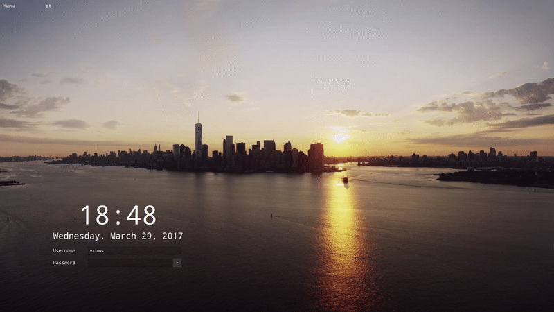
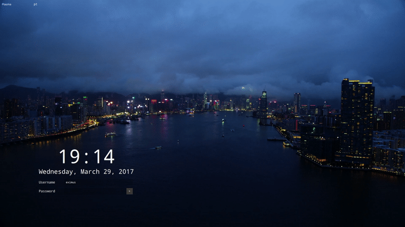
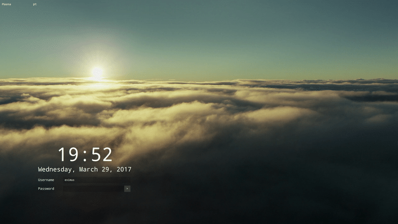
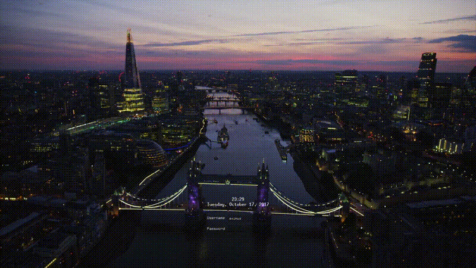

# Hornero Greeter (HorneroOS SDDM theme)

Cinematic SDDM login theme for HorneroOS: day/night Argentina footage
behind the clock and login form, fully offline. Qt6/QML port of the
upstream [aerial-sddm-theme](https://github.com/3ximus/aerial-sddm-theme)
by Fabio Almeida — see [UPSTREAM.md](UPSTREAM.md) for provenance and
[NOTICE](NOTICE) for attribution. The streamed Apple TV videos are gone;
backgrounds come from local media packs (see [media/README.md](media/README.md)).

Day/night (plus golden-hour) rotation is driven by `dayTimeStart` /
`dayTimeEnd` / `goldenHourStart` / `goldenHourEnd` in `theme.conf`.

## Dependencies

Qt6 + Qt 6 Multimedia with the GStreamer backend, SDDM, and GStreamer
"good" plugins:

- Arch: `pacman -S sddm qt6-multimedia gst-plugins-good`
  (+ `hornero-greeter-media-base` for the Argentina video pack)
- Debian/Ubuntu:
  `apt install sddm qml6-module-qtmultimedia gstreamer1.0-plugins-good`

## Installation

Clone and copy to `/usr/share/sddm/themes/hornero` (superuser needed):

```bash
git clone https://github.com/HorneroOS/greeter.git
sudo cp -r greeter /usr/share/sddm/themes/hornero
```

or install the `hornero-greeter` package (see `packaging/`). Select the
`hornero` theme in `sddm.conf`. Test without logging out:

```bash
sddm-greeter --test-mode --theme <path-to-this-repository>
```

## Other notes

No network is used at runtime. If no local clip can play (or with
`videoEnabled=false`), the background falls back to `background.jpg`.
Local footage ships via media packs bridged under `<theme>/media`
(see [media/README.md](media/README.md) for the pack format).

## Changing settings in `theme.conf.user`

Copy `theme.conf` values you want to override into `theme.conf.user`:

- `dayTimeStart`, `dayTimeEnd`, `goldenHourStart`,
  `goldenHourEnd` - day/night/golden-hour windows
- `bgImgDay` and `bgImgNight` - default background day/night image,
  supports animated GIF
- `videoEnabled`, `crossfadeDuration`, `testMode` - media playback
  behavior
- `displayFont` - font
- `clockFontSize`, `dateFontSize`, `labelFontSize`,
  `errorMsgFontSize`, `actionBarFontSize` - font sizes
- `clockFontColor`, `labelFontColor`, `errorMsgFontColor`,
  `actionBarFontColor` - font colors
- `dateFormat` and `timeFormat` - customize
  [date and time](https://doc.qt.io/qt-6/qml-qtqml-date.html) format
- `showLoginButton` - if false, hides the login button
- `showClearPasswordButton` - if false, hides the clear-password
  button that appears when text is input
- `passwordLeftMargin`, `usernameLeftMargin` - margin between input
  boxes and labels (fixes overlap with some fonts)
- `relativePositionX`, `relativePositionY` - position of the login
  box and clock
- `showTopBar` - if false, hides the wm/keyboard top bar
- `autofocusInput` - focus the password field on show
- `brandingEnabled`, `brandingLogo`, `brandingAccent` - optional
  Hornero branding overlay (see below)

Example `theme.conf.user`:

```ini
[General]
displayFont="Rubik"
showLoginButton=false
passwordLeftMargin=15
usernameLeftMargin=15
showTopBar=true
videoEnabled=true
```

## Preview





## Using my custom theme.conf.user



## License

Theme is licensed under GPL. See LICENSE, NOTICE, and UPSTREAM.md for
attribution and the full license text.

## Qt6 port (HorneroOS)

The theme was migrated from Qt5 to Qt6: `QMediaPlaylist` is gone, so
background video is sequenced by `components/MediaDeck.qml` (dual Qt6
`MediaPlayer`/`VideoOutput` pairs with a 2-4 s crossfade) driven by
`components/MediaCatalog.js` and the generated `media/catalog.js`
(regenerate from the `media/catalog.json` source of truth with
`scripts/media/build-catalog`; Qt disables XHR GET on local files, so the
runtime catalog is imported synchronously, never fetched).
No network is used at runtime; with no local clips (or with
`videoEnabled=false`) the greeter falls back to `background.jpg`. The
`hornero-greeter-media-base` pack ships 8 Argentina clips; the runtime
catalog wires 7 into rotation (Iguazu, Perito Moreno x2, Ushuaia, Buenos
Aires, Bariloche by day; mountain lake dimmed at night). The theme
package bridges them in under `<theme>/media/base`.
New `theme.conf` keys: `videoEnabled`, `crossfadeDuration`, `testMode`.
See `media/README.md` for the pack format.

## HorneroOS branding (optional overlay)

The greeter intentionally preserves the upstream visual and interaction
model. HorneroOS customizations are limited to: offline Argentina media;
an optional minimal branding overlay (`components/BrandingMark.qml`, a
small symbolic mark in the corner); configurable branding tokens
(`brandingEnabled`, `brandingLogo`, `brandingAccent`, defaulting to the
upstream red). Set `brandingEnabled=false` for pure upstream
presentation. No layout, interaction, or behavior changes with branding
on or off. The logo ships with the theme; no network, no dotfiles.

## QML lint, format, and tests

- `sh scripts/qml-lint.sh` runs `qmllint` on every QML file and verifies
  `qmlformat` cleanliness (`FORMAT=1 sh scripts/qml-lint.sh` reformats).
- `python3 -m pytest tests/ -q` runs the unit suites: catalog schema,
  duplicate IDs, remote-URL ban, dayparts, `theme.conf` contract, the
  `MediaCatalog.js` sequencer (via node), file permissions for the `sddm`
  user, and the `qmllint` gate. The same steps run in CI
  (`.github/workflows/qml.yml`).
